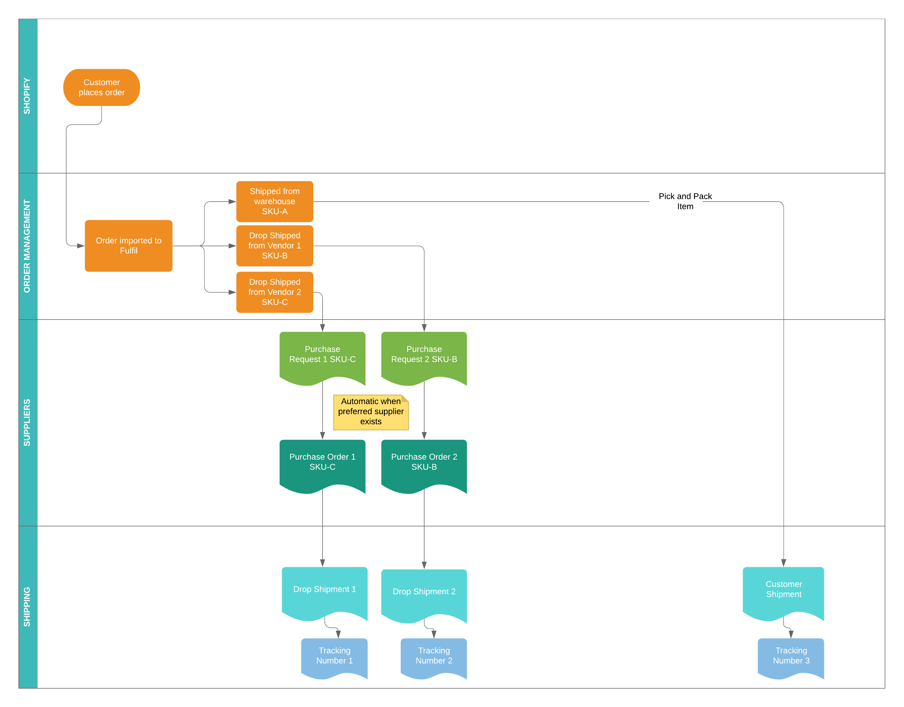

Drop Shipping
=============

This guide explains how to use the purchasing and drop shipping API to
manage and automate your drop-shipping side of the business.

.. contents:: In this guide

How drop shipping works
-----------------------

The easiest way to understand how drop shipment works is the lifecycle
of a customer order that is drop shipped.



The purchasing workflow is triggered after a customer order with drop
shipped line items is processed.

Purchase Order Lifecycle
````````````````````````

The purchase order is created in the confirmed state. At this point, it
is sent to the supplier in one for or the other. Fulfil supports sending
this by email (as attachment), through the supplier portal or through EDI.

If the medium of sending allows a separate acknowledgement from the supplier,
the purchase order should be kept in the `confirmed` status and only
`processed` after an acknowledgement is received. So in the case of the
supplier portal or EDI, the status of the purchase order changes to
`processing` only after the purchase order has been acknowledged by
the supplier.

On the other hand, if the supplier accepts a purchase order by email,
then there is no opportunity to have an acknowledgement step. So the
`processing` action is driven by the sending step of the email.

Drop Shipment Lifecycle
```````````````````````

The drop shipment record tracks the delivery of the item from supplier
to the customer. This document covers a supplier shipment (supplier to
warehouse) for in-stock items and the subsequent customer shipments (from
warehouse to customers) in one step without the inventory ever touching
the warehouse.

The drop shipment record is created when the drop ship purchase order is
processed. The drop shipment is created in the `waiting` state (waiting
to be sent).

The subsequent stages of a drop shipment are:

* **Shipped**: When the items from supplier are sent. At this point a
  draft A/P Invoice is created for the supplier in Fulfil.
* **Done**: When the drop shipment has been completed and delivered.
  At this point Fulfil creates an A/R invoice for the customer to
  recognize revenue and 

Shipped vs Done
~~~~~~~~~~~~~~~

The two stage process is not required for B2C/D2C situations where
revenue is recognized as soon as the items are shipped. 

For B2B situations, especially where the customer is located in a
different country or region, the expectation from the customer on
when their credit terms start could be different. If the customer
expects the credit days to start when the items are shipped, then
this is similar to the B2C situation. If the credit terms start
when the items are delivered or another event, then the drop shipment
should be marked as done only when the A/R invoice should be raised.

Using the API to send purchase orders
-------------------------------------

The following API calls will help you find purchase orders, get
the required details for a drop ship purchase order and process
the purchase order (when the supplier acknowledges the PO).

Get confirmed purchase orders
`````````````````````````````

To get confirmed purchase order, you can use the `search_read`
api on the `purchase.purchase` resource.

.. code-block:: shell

   curl -X PUT \
     https://{merchant}.fulfil.io/api/{version}/model/purchase.purchase/search_read \
     -H 'Content-Type: application/json' \
     -H 'X-API-KEY: {version}' \
     -d '[
           [
                   ["state", "=", "confirmed"]
           ],
           null,
           100,
           [
                   ["purchase_date", "desc"]
           ],
           [
                   "id",
                   "purchase_date",
                   "number",
                   "reference",
                   
                   "party",
                   "party.name",
                   "party.code",
                   "payment_term.name",
                   "currency.code",
                   
                   "invoice_address",
                   "invoice_address.full_address",
                   
                   "customer",
                   "customer.name",
                   "customer.code",
                   "delivery_address",
                   "delivery_address.full_address",
                   
                   "lines"
           ]
         ]'


The response will have a list (array) of purchase order objects. The line
items should be fetched on a separate API call.

Get order lines
```````````````

If you have a list of line ids (for example from previous step), then the
`read` endpoint works better.

In this example, we are requesting the details of lines with ids 1173
and 1072.

.. code-block:: shell

   curl -X PUT \
     https://{merchant}.fulfil.io/api/{version}/model/purchase.line/read \
     -H 'Content-Type: application/json' \
     -H 'X-API-KEY: {your-api-key}' 
     -d '[
           [1173, 1072],
           [
                   "id",
                   "purchase",
                   "purchase.number",
                   
                   "product",
                   "product.code",
                   "product.variant_name",
                   "product.template.name",
                   "product.upc",
                   
                   "supplier_product_name",
                   "supplier_product_code",
                   
                   "quantity",
                   "unit_price",
                   "unit.name",
                   "unit.symbol"
           ]
         ]'


Process the Purchase Order
``````````````````````````

When the supplier has acknowledged the purchase order, it's time
to process the purchase order. To process a PO, you will need the
ID of the po and send a PUT request to the process endpoint.

.. code-block:: shell

   curl -X PUT \
     https://{merchant}.fulfil.io/api/{version}/model/purchase.purchase/process \
     -H 'Content-Type: application/json' \
     -H 'X-API-KEY: {your-api-key}' 
     -d '[
           [117, 118]
         ]'

Where the ids of the purchase orders are 117 and 118.

Using the API to update drop shipments
--------------------------------------

After the purchase order has been processed, a drop shipment would
have been created in the waiting state. 

Finding Drop Shipments
``````````````````````

Depending on the information available from the vendor feed, you may
have a reference number or a purchase order number from which you will
want to find the related drop shipment records.

.. code-block:: shell

   curl -X PUT \
     https://{merchant}.fulfil.io/api/{version}/purchase.purchase/search_read \
     -H 'Content-Type: application/json' \
     -H 'X-API-KEY: {your-api-key}' 
     -d '[
           [
                   ["number", "in", ["PO719","PO777"]]
           ],
           null,
           100,
           null,
           [
                   "id",
                   "number",
                   "drop_shipments"
           ]
         ]'

The `drop_shipments` attribute will be a list of ids of the drop shipments
associated with this purchase order.

If the only available information is the supplier's po reference, then the
search clause would be

.. code-block:: JSON

   ["reference", "in", ["A12344", "1232323"]]


Marking drop shipments as shipped
`````````````````````````````````

When the supplier has shipped the items, it's time
to mark the drop shipments as shipped. To shi, you will need the
ID of the drop shipment and send a PUT request to the ship endpoint.

.. code-block:: shell

   curl -X PUT \
     https://{merchant}.fulfil.io/api/{version}/model/stock.shipment.drop/ship \
     -H 'Content-Type: application/json' \
     -H 'X-API-KEY: {your-api-key}' 
     -d '[
           [117, 118]
         ]'

Associating tracking numbers
````````````````````````````

If you have a tracking number provided by the supplier for the shipment, you
might want to add it to the drop shipment. The tracking number is a separate
object on Fulfil that can then be associated with many shipment related
records including drop shipments.

**Step 1: Create a tracking number**

.. code-block:: shell

   curl -X POST \
     https://{merchant}.fulfil.io/api/{version}/model/shipment.tracking/create \
     -H 'Content-Type: application/json' \
     -H 'X-API-KEY: {your-api-key}' 
     -d '[
           [[{"tracking_number": "1Z1234E765432123", "carrier": 1}]]
         ]'


The carrier id is the ID of the shipping carrier record in Fulfil. To find your
list of shipping carriers and IDs, navigate to Settings > Carriers.

**Step 2: Associate tracking number with Drop Shipment**

.. code-block:: shell

   curl -X POST \
     https://{merchant}.fulfil.io/api/{version}/model/stock.shipment.drop/write \
     -H 'Content-Type: application/json' \
     -H 'X-API-KEY: {your-api-key}' 
     -d '[
          [117],
          {"tracking_number":137676, "carrier":1}
      ]'


Where 117 is the ID of the drop shipment and 137676 is the id of the tracking
number that was created in the previous step.


Marking drop shipments as done
``````````````````````````````

Similar to ship step, this can be done with a PUT call to the `done`
endpoint.

.. code-block:: shell

   curl -X PUT \
     https://{merchant}.fulfil.io/api/{version}/model/stock.shipment.drop/done \
     -H 'Content-Type: application/json' \
     -H 'X-API-KEY: {your-api-key}' 
     -d '[
           [117, 118]
         ]'
